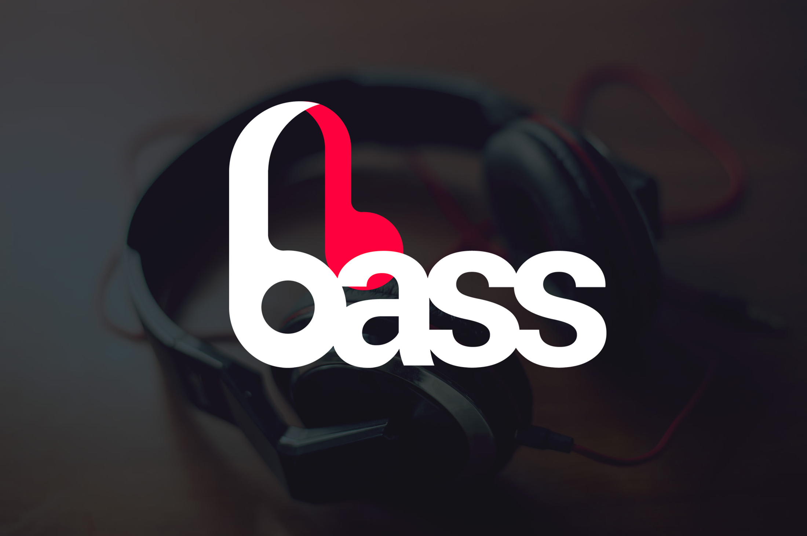

# Bass

### [See Live](https://gabrielecanepa.github.io/bass)

---

> The palette and all the images not developed by the author belong to *Codecademy*. This sample web page has never been used for lucrative purposes and outside Codecademy's environment, and is only available at [Github's author personal page](https://www.github.com/gabrielecanepa) and [Codecademy's profile](https://www.codecademy.com/gabrielecanepa).

**Bass** is an `HTML`, `CSS` and `Bootstrap` powered web template.

It was realized as a sample project after completing all the introduction courses on the popular education website 

The project was mainly inspired by the courses [HTML & CSS](https://www.codecademy.com/learn/web) and [Make a Website](https://www.codecademy.com/learn/make-a-website).
